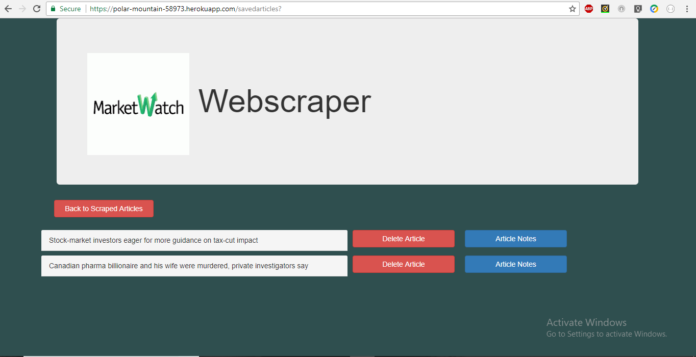

# Webscraper

WebScraper is an application that scrapes all headlines from MarketWatch.com. Web scraper uses mongoose and mongoDB to store the scraped articles.

WebScraper app is hosted at: https://polar-mountain-58973.herokuapp.com/

## Technology Stack:
	
	* Front End Development- HTML/CSS/Bootstrap/Handlebars
	* Back End Development- Express/Node.js/Mongoose/MongoDB

## Functionality

1. The User arrives on the Web scraper Landing Page

2. The User clicks on Scrape. The user is guided to the scraped articles page.

3. The user can click on save articles button, to save the articles.

4. The user can go to the saved articles page by clicking on saved articles button.

5. The User can add and delete Notes to a specific article.

6. The user can delete articles from saved articles.

7. The user can go back to scraped articles using back to scraped articles button.

